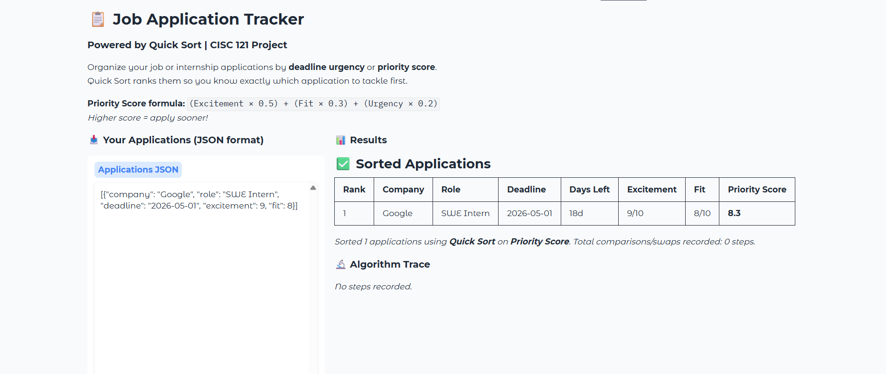
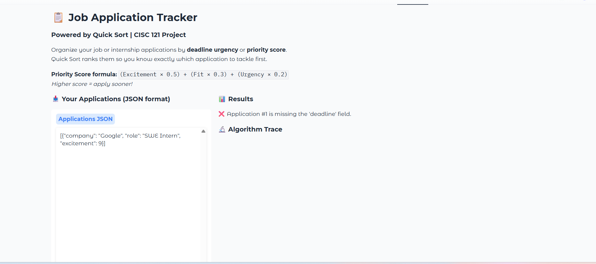
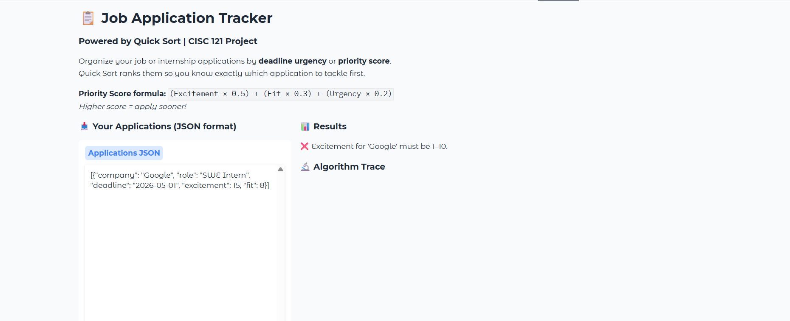
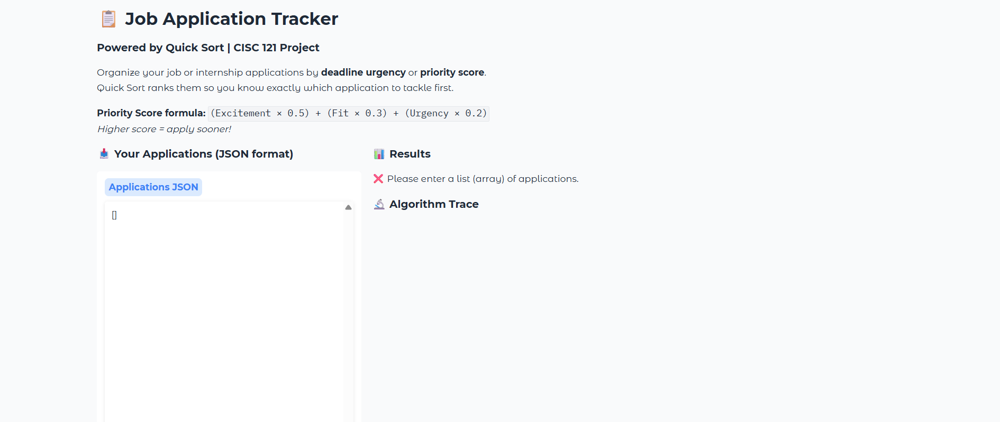

# Job Application Tracker — Quick Sort Visualizer

## Chosen Problem

We can all acknowledge that managing job and internship applications can be stressful at times when you don't know which one to prioritize. This app takes a list of your applications and uses Quick Sort to rank them by by the deadline urgency or an custome made priority score, so you always know what to work on and apply to next.

## Chosen Algorithm

I dicided to choose Quick Sort because:

- Applications need to be ranked by a computed score, which Quick Sort handles has the ability to efficiently.

- Quick Sort's average time complexity of O(n log n) makes it a great fit to lists of any practical size.

- As we learned in class, unlike Merge Sort, Quick Sort sorts in place, and it makes the the visualization easier to trace since items move within a single list rather than across sub-arrays.

**Assumption:** All deadlines are provided in `YYYY-MM-DD` format and excitement/fit scores are integers from 1–10.

**Preconditions**
For this, the data does not need to be pre orpdered since Quick Sort can work on any arrangement. The apps encorses that that: All required fields must be presnet, deadlines must have a valid date in YYYY-MM-DD format and all excitement/fit must be integers from 1 thorugh 10. If the user does not follow these, a clear error message will show to inform the user.

**Priority Score Formula:**

Priority Score = (excitement × 0.5) + (fit × 0.3) + (urgency_bonus × 0.2)

- `excitement` (1–10): how excited you are about the role and getting the placement.

- `fit` (1–10): how well the role matches your skills.

- `urgency_bonus` (0–10): scales from 10 (deadline today) down to 0 (60+ days away)

Higher score = apply sooner.

## Demo video/gif/screenshot of test

 
Screenshot 1 - User Interface + Results
![App Demo] (Screenshot_2026-04-12_160759.png)
Sceenshot 2 - Quick Sort Steps Display #1

Screenshot 3 - Quick Sort Steps Display #2

## Problem Breakdown & Computational Thinking

### Flowchart

### Four Pillars of Computational Thinking

**Decomposition** 
The problem can be broken into four steps: 
first validate the user's input, then calculate a priority score for each application, then run Quick Sort on the list while recording each step, and finally display the sorted results and trace to the user.

**Pattern Recognition**
Quick Sort basically repeats its self over and over. It picks a pivot, compares every other item to it, swaps things that are out of place, locks the pivot into its final position, then repeats this on the smaller sub lists on each side.

**Abstraction**
The user only sees company names and their scores being compared — they don't need to know how the index tracking or recursion works behind the scenes. The app hides all of that and just shows what's relevant: which items are being compared, when a swap happens, and where the pivot ends up.

**Algorithm Design**
The user their applications as JSON and picks a sort key. The app validates the input then computes a score for each application, runs Quick Sort while logging every comparison and swap, then displays the final ranked table and the step-by-step trace side by side.

## Steps to Run
Step 1: Make sure you have Python installed on your computer
Step 2. Open your termial and run: pip install gradio
Step 3. Download or cline this repository
Step 4. In your termial, find your project folder and run "python app.py"
Step 5. Open your browser and go to http://127.0.0.1:7860 **Keep your terminal OPEN or else it will not run the application**
Step 6. The app will load with sample data, then click sort my applications to see it in real time. 

## Requirements.txt
This project only requires one package:
gradio>=4.0.0

## Hugging Face Link
https://huggingface.co/spaces/Chapcoda/job-tracker-quicksort

## Testing

Test 1 - When given only one application, the app returns it correctly with 0 steps recorded (since there is nothing to compare it against).

When the deadline field was left out, the app displayed a clear error stating to te user exactly which field was missing without crashing.

When entered a invalid excitement score (15), the app returned an validation error, preventing the sort from running until the input is corrected.

When a empty list was presnet, the app returned to the user to input an application.
## Author & AI Acknowledgment

**Author:** Noah Chapman — 20538805 — CISC 121, 001

**Sources:**
- Quick Sort algorithm: CISC 121 course notes + [GeeksForGeeks Lomuto partition explanation](https://www.geeksforgeeks.org/quick-sort/)
- VisuAlgo for algorithm visual reference: [visualgo.net](https://visualgo.net/en/sorting)

**AI Use (Level 4):**
This project was developed with AI assistance (Claude) for: initial code structure and Gradio UI layout. All algorithm logic was fully reviewed and understoo by me, additionaly no built in sorting functions were used in the algorithm.
